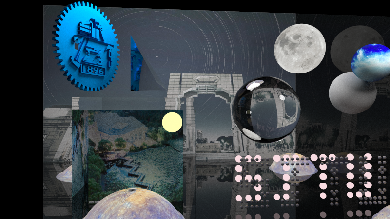

# README

## Introduction

This project is to implement a Ray Tracer in C++. We construct our project on the basis of *Ray Tracing in One Weekend* series, and add some innovative functions and classes, mainly in 4 parts: multi-thread acceleration, SAH: faster bounding box hierarchy, showing wavefront .obj file and better algorithm for sampling towards the light.

## Effects



## Environment

Linux

- C++11
- CMake 3.1 or more updated versions

## Installation

To build the project, you need to type the following commands in the terminal:

```shell
mkdir build
cd build
cmake ..
make
```

To run the rendering, you need to run the command below:

```shell
./RayTracePlanes > image.ppm
```

Then we can write our final rendering outcome into a *.ppm* file.